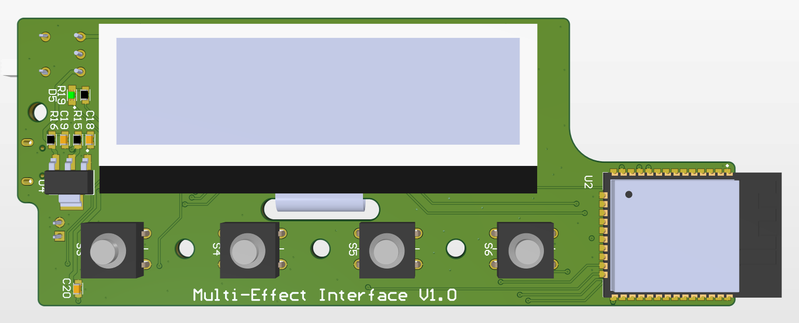

# Multi-Effect Interface
An interface for wireless control of the [multi-effect](https://github.com/CraigCrundwell/Multi-Effect) system for electric guitars.    

## About
This is a PCB that I'm developing for a university capstone project. This PCB is for the control interface which is used wirelessly swap and adjust the effect processing in the [multi-effect processor.](https://github.com/CraigCrundwell/Multi-Effect) More details to come... 
